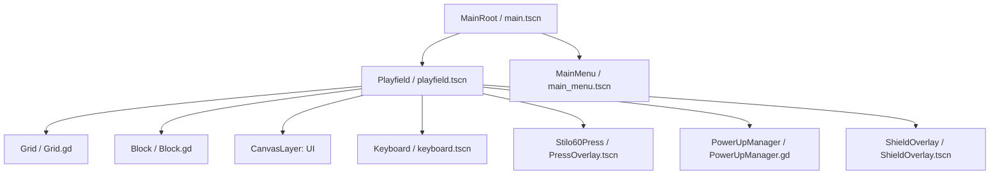

# Spielarchitektur und Design (ARCHITECTURE.md)

Dieses Dokument beschreibt die Softwarearchitektur, Szenenstrukturen und Datenflüsse für **Intercable Connectris**.

> [!NOTE]
> Dieses Dokument wird von **Claude Code** (Senior Engineer & Architect) befüllt und gepflegt.

---

## 1. Szenen-Graph & Komponentenstruktur

Das Spiel wird in Godot 4 modular und signalgesteuert aufgebaut. Die Szenen-Hierarchie trennt die übergeordnete Spielsteuerung von der eigentlichen Spielfeldlogik und der Benutzeroberfläche.



### Komponenten-Zuständigkeiten:
1. **MainRoot (`main.tscn`)**: 
   * Globaler Einstiegspunkt und Szenen-Manager.
   * Lädt/Wechselt zwischen Hauptmenü und Spielfeld.
   * Verwaltet Kiosk-Modus-Einstellungen (Vollbild, Cursor-Sichtbarkeit).
2. **Playfield (`playfield.tscn`)**:
   * Spiel-Schleife (Game Loop), Fall-Geschwindigkeit (Gravity Timer) und Punkteberechnung.
   * Verarbeitet Benutzereingaben (Links, Rechts, Soft/Hard Drop, Rotation).
   * Spawnt neue Blöcke und steuert den Lebenszyklus des aktiven Blocks.
   * Koordiniert die STILO60-Presse-Animation und blockiert Eingaben während des Pressvorgangs.
3. **Grid (`Grid.gd` / Node2D)**:
   * Verwaltet das 2D-Gitter (10 Spalten x 20 Zeilen).
   * Führt Kollisionsprüfungen (`is_valid_position`) für den fallenden Block durch.
   * Speichert feste Blöcke (`lock_block`) und prüft Zeilen.
   * Führt die *Workflow-Verpressungsprüfung* durch und löscht selektiv nur regelkonforme Zeilen.
   * **Neu in Slice 3**: Führt Grid-Manipulationen für Power-ups aus (Segmente abisolieren, Zeilen von unten löschen, Slick-Cutter-Reihe finden).
4. **Block (`Block.gd` / Node2D)**:
   * Repräsentiert das fallende Tetromino (7 Standardformen: I, J, L, O, S, T, Z).
   * Verwaltet seine eigene Gitterposition, Farbe und Rotationsmatrizen.
   * Jede Zelle des Blocks besitzt ein eigenes Segment mit einem Zustand (`Segment.Type`).
5. **PressOverlay (`PressOverlay.tscn` / Node2D)**:
   * Repräsentiert visuell den Kopf der STILO60-Presse.
   * Fährt horizontal zentriert über dem Grid herunter, um die Verpressung visuell darzustellen.
6. **PowerUpManager (`PowerUpManager.gd` / Node)**:
   * **Neu in Slice 3**: Verwaltet die Cooldowns (20 Sekunden) für alle vier Power-ups.
   * Verarbeitet die Tastenkombinationen (Tasten 1, 2, 3, 4) und Signale der UI-Buttons.
7. **ShieldOverlay (`ShieldOverlay.tscn` / Panel)**:
   * **Neu in Slice 3**: Stellt ein leuchtendes Schild-Overlay (Cyan) um das Spielfeld dar, solange das VDE-Schutzschild aktiv ist.

---

## 2. Klassendesign (GDScript-Klassenschnittstellen)

### 2.1 SegmentType & Datenstrukturen
Jede aktive Zelle im Spielfeld oder in einem fallenden Block wird durch ein Segment repräsentiert.

```gdscript
class_name Segment
extends RefCounted

enum Type {
	ISOLATED,    # Isoliertes Kabel (Rot, Ausgangszustand)
	BARE,        # Abisoliertes Kabel (Grau, nach Laser/Abisolierer)
	CRIMP_LUG    # Gecrimpter Kabelschuh (Grün, nach Crimper)
}

var type: Type = Type.ISOLATED
var color: Color = Color.WHITE

func _init(p_type: Type = Type.ISOLATED, p_color: Color = Color.WHITE) -> void:
	type = p_type
	color = p_color
```

### 2.2 Block.gd (Klasse: `Block`)
```gdscript
class_name Block
extends Node2D

var shape_matrix: Array = []
var cells_data: Array = []
var grid_position: Vector2i = Vector2i.ZERO
var block_color: Color = Color.WHITE

func initialize(p_shape_type: int) -> void:
	pass

func rotate_right() -> void:
	pass

func rotate_left() -> void:
	pass

func get_active_segments() -> Array[Dictionary]:
	return []
```

### 2.3 Grid.gd (Klasse: `Grid`)
```gdscript
class_name Grid
extends Node2D

const COLUMNS: int = 10
const ROWS: int = 20
const CELL_SIZE: int = 48

var grid_data: Array = []
var _textures: Dictionary = {}

func _ready() -> void:
	_init_grid()
	_load_textures()

func _init_grid() -> void:
	pass

func is_valid_position(block: Block, offset: Vector2i) -> bool:
	return true

func lock_block(block: Block) -> void:
	pass

func is_row_crimp_valid(p_row_index: int) -> bool:
	return true

func check_full_rows_status() -> Dictionary:
	return {"valid": [], "invalid": []}

func clear_row(p_row_index: int) -> void:
	pass

# --- NEU IN SLICE 3: POWER-UP GRID AKTIONEN ---

# AMX-Laser: Transformiert alle ISOLATED Segmente im Grid zu BARE
func strip_all_isolated_segments() -> void:
	for r in range(ROWS):
		for c in range(COLUMNS):
			if grid_data[r][c] != null and grid_data[r][c].type == Segment.Type.ISOLATED:
				grid_data[r][c].type = Segment.Type.BARE
	queue_redraw()

# STILO60-Beben & VDE-Schutzschild: Löscht die untersten N Zeilen des Gitters
func clear_bottom_rows(p_count: int) -> void:
	var rows_to_remove: int = min(p_count, ROWS)
	for i in range(rows_to_remove):
		# Löscht die letzte Reihe (Index 19)
		grid_data.remove_at(ROWS - 1)
		# Fügt oben eine neue leere Reihe ein
		var new_row: Array = []
		new_row.resize(COLUMNS)
		new_row.fill(null)
		grid_data.insert(0, new_row)
	queue_redraw()

# Slick-Cutter: Löscht die unterste belegte, ungültige Reihe (oder falls keine da, die unterste belegte)
func clear_slick_cutter_target() -> void:
	# 1. Suche nach der untersten vollen, aber ungültigen Reihe (von unten nach oben)
	var status: Dictionary = check_full_rows_status()
	var invalid_rows: Array = status["invalid"]
	if invalid_rows.size() > 0:
		invalid_rows.sort()
		var target_row: int = invalid_rows.back() # Die unterste ungültige Zeile
		clear_row(target_row)
		return
		
	# 2. Wenn keine volle ungültige vorhanden, suche die unterste belegte Zeile (mind. 1 Zelle belegt)
	for r in range(ROWS - 1, -1, -1):
		var has_data: bool = false
		for c in range(COLUMNS):
			if grid_data[r][c] != null:
				has_data = true
				break
		if has_data:
			clear_row(r)
			return
