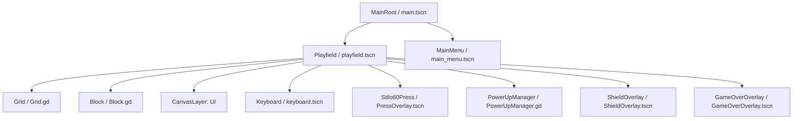
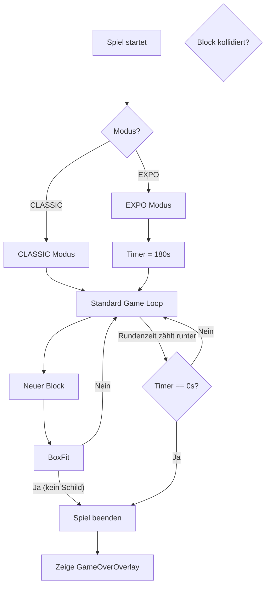
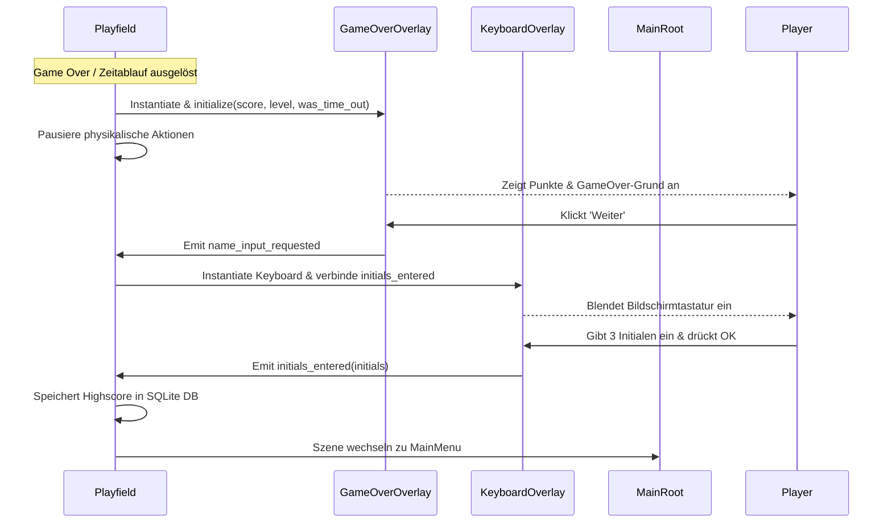

# Spielarchitektur und Design (ARCHITECTURE.md)

Dieses Dokument beschreibt die Softwarearchitektur, Szenenstrukturen und Datenflüsse für **Intercable Connectris**.

> [!NOTE]
> Dieses Dokument wird von **Claude Code** (Senior Engineer & Architect) befüllt und gepflegt.

---

## 1. Szenen-Graph & Komponentenstruktur

Das Spiel wird in Godot 4 modular und signalgesteuert aufgebaut. Die Szenen-Hierarchie trennt die übergeordnete Spielsteuerung von der eigentlichen Spielfeldlogik und der Benutzeroberfläche.



### Global Autoloads (Singletons)
* **SettingsManager (`SettingsManager.gd`)**: Verwaltet spielsitzungsübergreifende Einstellungen wie Spielmodus, Rundenzeitlimits und Kiosk-Einstellungen.

### Komponenten-Zuständigkeiten:
1. **MainRoot (`main.tscn`)**: 
   * Globaler Einstiegspunkt und Szenen-Manager.
   * Lädt/Wechselt zwischen Hauptmenü und Spielfeld.
   * Verwaltet Kiosk-Modus-Einstellungen (Vollbild, Cursor-Sichtbarkeit).
2. **Playfield (`playfield.tscn`)**:
   * Spiel-Schleife (Game Loop), Fall-Geschwindigkeit (Gravity Timer) und Punkteberechnung.
   * Verarbeitet Benutzereingaben (Links, Rechts, Soft/Hard Drop, Rotation).
   * Spawnt neue Blöcke und steuert den Lebenszyklus des aktiven Blocks.
   * Koordiniert die STILO60-Presse-Animation und blockiert Eingaben während des Pressvorgangs.
   * **Neu in Slice 4**: Verwaltet den EXPO-Rundentimer und stoppt das Spiel bei Zeitablauf.
3. **Grid (`Grid.gd` / Node2D)**:
   * Verwaltet das 2D-Gitter (10 Spalten x 20 Zeilen).
   * Führt Kollisionsprüfungen (`is_valid_position`) für den fallenden Block durch.
   * Speichert feste Blöcke (`lock_block`) und prüft Zeilen.
   * Führt die *Workflow-Verpressungsprüfung* durch und löscht selektiv nur regelkonforme Zeilen.
   * Führt Gitter-Manipulationen für Power-ups aus.
4. **Block (`Block.gd` / Node2D)**:
   * Repräsentiert das fallende Tetromino (7 Standardformen).
   * Jede Zelle des Blocks besitzt ein eigenes Segment mit einem Zustand (`Segment.Type`).
5. **PressOverlay (`PressOverlay.tscn` / Node2D)**:
   * Repräsentiert visuell den Kopf der STILO60-Presse.
   * Fährt horizontal zentriert über dem Gitter herunter, um die Verpressung visuell darzustellen.
6. **PowerUpManager (`PowerUpManager.gd` / Node)**:
   * Verwaltet die Cooldowns (20 Sekunden) für alle vier Power-ups.
   * Verarbeitet die Tastenkombinationen (Tasten 1, 2, 3, 4) und Signale der UI-Buttons.
7. **ShieldOverlay (`ShieldOverlay.tscn` / Panel)**:
   * Stellt ein leuchtendes Schild-Overlay (Cyan) um das Spielfeld dar, solange das VDE-Schutzschild aktiv ist.
8. **GameOverOverlay (`GameOverOverlay.tscn` / Panel)**:
   * **Neu in Slice 4**: Zeigt nach Spielende (entweder durch Grid-Überlauf oder Zeitablauf) ein animiertes Pop-up mit Score und Level an und leitet den Spieler zur Highscore-Eingabe weiter.

---

## 2. Klassendesign (GDScript-Klassenschnittstellen)

### 2.1 SegmentType & Datenstrukturen
Jede aktive Zelle im Spielfeld oder in einem fallenden Block wird durch ein Segment repräsentiert.

```gdscript
class_name Segment
extends RefCounted

enum Type {
	ISOLATED,    # Isoliertes Kabel (Rot, Ausgangszustand)
	BARE,        # Abisoliertes Kabel (Grau, nach Laser/Abisolierer)
	CRIMP_LUG    # Gecrimpter Kabelschuh (Grün, nach Crimper)
}

var type: Type = Type.ISOLATED
var color: Color = Color.WHITE

func _init(p_type: Type = Type.ISOLATED, p_color: Color = Color.WHITE) -> void:
	type = p_type
	color = p_color
```

### 2.2 Block.gd (Klasse: `Block`)
```gdscript
class_name Block
extends Node2D

var shape_matrix: Array = []
var cells_data: Array = []
var grid_position: Vector2i = Vector2i.ZERO
var block_color: Color = Color.WHITE

func initialize(p_shape_type: int) -> void:
	pass

func rotate_right() -> void:
	pass

func rotate_left() -> void:
	pass

func get_active_segments() -> Array[Dictionary]:
	return []
```

### 2.3 Grid.gd (Klasse: `Grid`)
```gdscript
class_name Grid
extends Node2D

const COLUMNS: int = 10
const ROWS: int = 20
const CELL_SIZE: int = 48

var grid_data: Array = []
var _textures: Dictionary = {}

func _ready() -> void:
	_init_grid()
	_load_textures()

func _init_grid() -> void:
	pass

func is_valid_position(block: Block, offset: Vector2i) -> bool:
	return true

func lock_block(block: Block) -> void:
	pass

func is_row_crimp_valid(p_row_index: int) -> bool:
	return true

func check_full_rows_status() -> Dictionary:
	return {"valid": [], "invalid": []}

func clear_row(p_row_index: int) -> void:
	pass

func strip_all_isolated_segments() -> void:
	pass

func clear_bottom_rows(p_count: int) -> void:
	pass

func clear_slick_cutter_target() -> void:
	pass
```

### 2.4 Playfield.gd (Klasse: `Playfield`)
```gdscript
class_name Playfield
extends Node2D

signal score_changed(new_score: int, level: int)
signal timer_updated(time_left: float)
signal game_over_triggered(final_score: int, level: int, was_time_out: bool)
signal crimp_press_started(row_index: int)
signal crimp_press_completed(row_index: int)
signal shield_state_changed(active: bool, time_left: float)
signal camera_shake_triggered()

@export var fall_interval_start: float = 1.0

var grid: Grid
var current_block: Block

var _fall_timer: float = 0.0
var _fall_interval: float = 1.0
var _score: int = 0
var _level: int = 1
var _total_rows_cleared: int = 0
var _game_over: bool = false
var _is_animating_press: bool = false

# --- NEU IN SLICE 4: EXPO TIMER ---
var _time_left: float = 180.0

@onready var _press_overlay: Node2D = $PressOverlay
@onready var _sfx_press: AudioStreamPlayer = $SfxPress
@onready var _spark_particles: CPUParticles2D = $SparkParticles
@onready var _sfx_laser: AudioStreamPlayer = $SfxLaser
@onready var _sfx_cut: AudioStreamPlayer = $SfxCut
@onready var _camera: Camera2D = $Camera2D
@onready var _shield_overlay: Control = $ShieldOverlay

var _shield_time_left: float = 0.0

func _ready() -> void:
	# Timer für EXPO-Modus initialisieren
	if SettingsManager.current_mode == SettingsManager.GameMode.EXPO:
		_time_left = SettingsManager.expo_round_duration
		timer_updated.emit(_time_left)
	else:
		_time_left = 0.0

func _process(p_delta: float) -> void:
	if _game_over or _is_animating_press:
		return
		
	# Timer im EXPO-Modus herunterzählen
	if SettingsManager.current_mode == SettingsManager.GameMode.EXPO:
		_time_left -= p_delta
		if _time_left <= 0.0:
			_time_left = 0.0
			timer_updated.emit(_time_left)
			_trigger_game_over(true)
			return
		timer_updated.emit(_time_left)

	# VDE-Schutzschild Timer aktualisieren
	if _shield_time_left > 0.0:
		_shield_time_left -= p_delta
		shield_state_changed.emit(true, _shield_time_left)
		if _shield_time_left <= 0.0:
			_shield_time_left = 0.0
			_shield_overlay.hide()
			shield_state_changed.emit(false, 0.0)

	# Normaler Loop...

func _trigger_game_over(p_was_time_out: bool) -> void:
	_game_over = true
	if current_block != null:
		current_block.queue_free()
		current_block = null
	game_over_triggered.emit(_score, _level, p_was_time_out)

func is_shield_active() -> bool:
	return _shield_time_left > 0.0

func activate_vde_shield() -> void:
	pass

func spawn_new_block() -> void:
	# Falls kein Platz mehr beim Spawn vorhanden ist:
	# ... (Schild-Prüfung) ...
	# falls kein Schild aktiv:
	_trigger_game_over(false)

func _trigger_camera_shake() -> void:
	pass
```

### 2.5 PowerUpManager.gd (Klasse: `PowerUpManager`)
```gdscript
class_name PowerUpManager
extends Node
# ... (Siehe Slice 3) ...
```

### 2.6 SettingsManager.gd (Autoload Singleton: `SettingsManager`)
```gdscript
# SettingsManager.gd
extends Node

enum GameMode {
	CLASSIC, # Endlosmodus
	EXPO     # Messe-Modus mit Zeitbegrenzung
}

var current_mode: GameMode = GameMode.CLASSIC
var expo_round_duration: float = 180.0 # 3 Minuten Standard
var is_kiosk_mode: bool = true
var is_sound_enabled: bool = true

func _ready() -> void:
	load_settings()

func load_settings() -> void:
	# Lädt Einstellungen aus einer lokalen Konfigurationsdatei (user://settings.cfg)
	pass

func save_settings() -> void:
	# Speichert Einstellungen lokal ab
	pass
```

### 2.7 GameOverOverlay.gd (Klasse: `GameOverOverlay`)
```gdscript
class_name GameOverOverlay
extends Control

signal name_input_requested()

@onready var _title_label: Label = $Panel/VBoxContainer/TitleLabel
@onready var _score_label: Label = $Panel/VBoxContainer/ScoreLabel
@onready var _level_label: Label = $Panel/VBoxContainer/LevelLabel
@onready var _continue_button: Button = $Panel/VBoxContainer/ContinueButton

func initialize(p_score: int, p_level: int, p_was_time_out: bool) -> void:
	_title_label.text = "ZEIT ABGELAUFEN!" if p_was_time_out else "GAME OVER"
	_score_label.text = "Erreichte Punkte: %d" % p_score
	_level_label.text = "Level: %d" % p_level

func _on_ContinueButton_pressed() -> void:
	name_input_requested.emit()
	queue_free()
```

---

## 3. Datenfluss & State Machine (Slice 4)

### 3.4 Spielmodus-Datenfluss (EXPO vs. CLASSIC)


### 3.5 Game-Over- und Highscore-Übergangs-Workflow


---

## 4. SQLite Datenbank-Schema

Für die Highscore-Tabelle wird SQLite verwendet. Dies wird in GDScript über einen nativen C++-Wrapper oder ein GDExtension-Plugin angebunden.

### Tabelle: `highscores`
```sql
CREATE TABLE IF NOT EXISTS highscores (
    id INTEGER PRIMARY KEY AUTOINCREMENT,
    initials TEXT NOT NULL CHECK(length(initials) <= 3),
    score INTEGER NOT NULL,
    level INTEGER NOT NULL,
    date TEXT NOT NULL
);
```

* **Index**: Ein Index auf `score DESC, date ASC` optimiert die Abfrage der Top-10 Bestenliste.
* **Date**: Das Datum wird im standardisierten ISO-8601 UTC-Format (`YYYY-MM-DDTHH:MM:SSZ`) als Text gespeichert.
