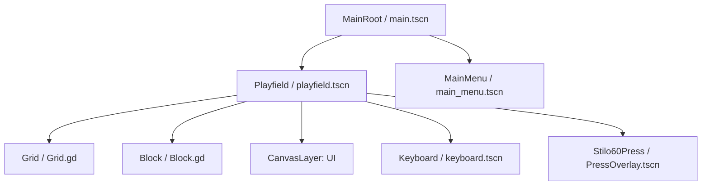

# Spielarchitektur und Design (ARCHITECTURE.md)

Dieses Dokument beschreibt die Softwarearchitektur, Szenenstrukturen und Datenflüsse für **Intercable Connectris**.

> [!NOTE]
> Dieses Dokument wird von **Claude Code** (Senior Engineer & Architect) befüllt und gepflegt.

---

## 1. Szenen-Graph & Komponentenstruktur

Das Spiel wird in Godot 4 modular und signalgesteuert aufgebaut. Die Szenen-Hierarchie trennt die übergeordnete Spielsteuerung von der eigentlichen Spielfeldlogik und der Benutzeroberfläche.



### Komponenten-Zuständigkeiten:
1. **MainRoot (`main.tscn`)**: 
   * Globaler Einstiegspunkt und Szenen-Manager.
   * Lädt/Wechselt zwischen Hauptmenü und Spielfeld.
   * Verwaltet Kiosk-Modus-Einstellungen (Vollbild, Cursor-Sichtbarkeit).
2. **Playfield (`playfield.tscn`)**:
   * Spiel-Schleife (Game Loop), Fall-Geschwindigkeit (Gravity Timer) und Punkteberechnung.
   * Verarbeitet Benutzereingaben (Links, Rechts, Soft/Hard Drop, Rotation).
   * Spawnt neue Blöcke und steuert den Lebenszyklus des aktiven Blocks.
   * **Neu in Slice 2**: Koordiniert die STILO60-Presse-Animation und blockiert Eingaben während des Pressvorgangs.
3. **Grid (`Grid.gd` / Node2D)**:
   * Verwaltet das 2D-Gitter (10 Spalten x 20 Zeilen).
   * Führt Kollisionsprüfungen (`is_valid_position`) für den fallenden Block durch.
   * Speichert feste Blöcke (`lock_block`) und prüft Zeilen.
   * **Neu in Slice 2**: Führt die *Workflow-Verpressungsprüfung* durch und löscht selektiv nur regelkonforme Zeilen.
4. **Block (`Block.gd` / Node2D)**:
   * Repräsentiert das fallende Tetromino (7 Standardformen: I, J, L, O, S, T, Z).
   * Verwaltet seine eigene Gitterposition, Farbe und Rotationsmatrizen.
   * Jede Zelle des Blocks besitzt ein eigenes Segment mit einem Zustand (`Segment.Type`).
5. **PressOverlay (`PressOverlay.tscn` / Node2D)**:
   * **Neu in Slice 2**: Repräsentiert visuell den Kopf der STILO60-Presse.
   * Fährt horizontal zentriert über dem Grid herunter, um die Verpressung visuell darzustellen.

---

## 2. Klassendesign (GDScript-Klassenschnittstellen)

### 2.1 SegmentType & Datenstrukturen
Jede aktive Zelle im Spielfeld oder in einem fallenden Block wird durch ein Segment repräsentiert.

```gdscript
class_name Segment
extends RefCounted

enum Type {
	ISOLATED,    # Isoliertes Kabel (Rot, Ausgangszustand)
	BARE,        # Abisoliertes Kabel (Grau, nach Laser/Abisolierer)
	CRIMP_LUG    # Gecrimpter Kabelschuh (Grün, nach Crimper)
}

var type: Type = Type.ISOLATED
var color: Color = Color.WHITE

func _init(p_type: Type = Type.ISOLATED, p_color: Color = Color.WHITE) -> void:
	type = p_type
	color = p_color
```

### 2.2 Block.gd (Klasse: `Block`)
```gdscript
class_name Block
extends Node2D

var shape_matrix: Array = []
var cells_data: Array = []
var grid_position: Vector2i = Vector2i.ZERO
var block_color: Color = Color.WHITE

func initialize(p_shape_type: int) -> void:
	pass

func rotate_right() -> void:
	pass

func rotate_left() -> void:
	pass

func get_active_segments() -> Array[Dictionary]:
	return []
```

### 2.3 Grid.gd (Klasse: `Grid`)
```gdscript
class_name Grid
extends Node2D

const COLUMNS: int = 10
const ROWS: int = 20
const CELL_SIZE: int = 48

var grid_data: Array = []
var _textures: Dictionary = {}

func _ready() -> void:
	_init_grid()
	_load_textures()

func _init_grid() -> void:
	pass

func is_valid_position(block: Block, offset: Vector2i) -> bool:
	return true

func lock_block(block: Block) -> void:
	pass

# --- NEU IN SLICE 2: VERPRESSUNGSPRÜFUNG ---

# Prüft, ob eine Zeile voll ist UND dem Connectris-Kabel-Workflow entspricht:
# - Spalte 0 und Spalte 9 müssen Segment.Type.CRIMP_LUG sein (Kabelschuh an den Enden)
# - Spalte 1 bis Spalte 8 müssen Segment.Type.BARE sein (abisoliertes Kabel dazwischen)
func is_row_crimp_valid(p_row_index: int) -> bool:
	# 1. Prüfen, ob die Zeile überhaupt vollständig gefüllt ist
	for c in range(COLUMNS):
		if grid_data[p_row_index][c] == null:
			return false
			
	# 2. Ränder prüfen (müssen CRIMP_LUG sein)
	if grid_data[p_row_index][0].type != Segment.Type.CRIMP_LUG:
		return false
	if grid_data[p_row_index][COLUMNS - 1].type != Segment.Type.CRIMP_LUG:
		return false
		
	# 3. Inneres prüfen (muss BARE sein)
	for c in range(1, COLUMNS - 1):
		if grid_data[p_row_index][c].type != Segment.Type.BARE:
			return false
			
	return true

# Findet alle VOLLEN Zeilen und teilt sie auf in:
# - Crimp-gültige Zeilen (werden gelöscht und geben Punkte)
# - Crimp-ungültige Zeilen (bleiben liegen und blockieren)
# Gibt ein Dictionary zurück: {"valid": Array[int], "invalid": Array[int]}
func check_full_rows_status() -> Dictionary:
	var valid_rows: Array[int] = []
	var invalid_rows: Array[int] = []
	
	for r in range(ROWS):
		var is_full: bool = true
		for c in range(COLUMNS):
			if grid_data[r][c] == null:
				is_full = false
				break
		if is_full:
			if is_row_crimp_valid(r):
				valid_rows.append(r)
			else:
				invalid_rows.append(r)
				
	return {"valid": valid_rows, "invalid": invalid_rows}

# Löscht eine spezifische Reihe und schiebt alle darüberliegenden Zeilen nach unten
func clear_row(p_row_index: int) -> void:
	pass

# Schiebt Spalten/Gitter compact nach unten (Schwerkraft-Kompaktierung bei Beben)
func shake_grid() -> void:
	pass
```

### 2.4 Playfield.gd (Klasse: `Playfield`)
```gdscript
class_name Playfield
extends Node2D

signal score_changed(new_score: int, level: int)
signal game_over_triggered(final_score: int)
signal crimp_press_started(row_index: int)
signal crimp_press_completed(row_index: int)

@export var fall_interval_start: float = 1.0

var grid: Grid
var current_block: Block

var _fall_timer: float = 0.0
var _fall_interval: float = 1.0
var _score: int = 0
var _level: int = 1
var _total_rows_cleared: int = 0
var _game_over: bool = false

# --- NEU IN SLICE 2: STILO60 PRESSE & ANIMATION ---
var _is_animating_press: bool = false
@onready var _press_overlay: Node2D = $PressOverlay
@onready var _sfx_press: AudioStreamPlayer = $SfxPress
@onready var _spark_particles: CPUParticles2D = $SparkParticles

func _ready() -> void:
	pass

func _process(p_delta: float) -> void:
	# Während der Press-Animation wird der Falltimer pausiert!
	if _game_over or _is_animating_press:
		return
	# Normaler Loop...
	pass

func _unhandled_input(p_event: InputEvent) -> void:
	# Während der Press-Animation werden Spielereingaben blockiert!
	if _game_over or _is_animating_press or current_block == null:
		return
	# Normales Input-Handling...
	pass

func move_block_down() -> void:
	if current_block == null or _game_over or _is_animating_press:
		return

	if grid.is_valid_position(current_block, Vector2i(0, 1)):
		current_block.grid_position.y += 1
		_update_block_visual_position()
	else:
		grid.lock_block(current_block)
		current_block.queue_free()
		current_block = null

		# Status aller Zeilen prüfen
		var status: Dictionary = grid.check_full_rows_status()
		var valid_rows: Array = status["valid"]
		
		if valid_rows.size() > 0:
			# Starte Animationssequenz für die korrekten Reihen
			_animate_press_sequence(valid_rows)
		else:
			# Keine gültigen Reihen -> Sofort nächster Block
			spawn_new_block()

# Sequenzierte Abarbeitung aller gültigen Zeilen von oben nach unten
func _animate_press_sequence(p_valid_rows: Array) -> void:
	_is_animating_press = true
	# Sortieren, damit wir von oben nach unten (oder umgekehrt) pressen
	p_valid_rows.sort()
	
	for row in p_valid_rows:
		crimp_press_started.emit(row)
		
		# Visuelle Positionierung der Presse vorbereiten (startet über dem Spielfeld)
		_press_overlay.position.x = 0
		_press_overlay.position.y = -Grid.CELL_SIZE
		_press_overlay.show()
		
		# Tween für Abwärtsbewegung erstellen
		var tween := create_tween()
		var target_y: float = row * Grid.CELL_SIZE
		
		# 1. Presse fährt auf die Zielzeile herunter (Dauer: ca. 0.4 Sekunden)
		tween.tween_property(_press_overlay, "position:y", target_y, 0.4)\
			.set_trans(Tween.TRANS_QUAD).set_ease(Tween.EASE_OUT)
			
		# 2. Aufprall / Pressvorgang triggern
		tween.tween_callback(func():
			_sfx_press.play() # Spielt pressen.wav ab
			_spark_particles.position = Vector2((Grid.COLUMNS * Grid.CELL_SIZE) / 2.0, target_y + Grid.CELL_SIZE / 2.0)
			_spark_particles.restart() # Partikel-Burst
			# Optional: Viewport-Shake
		)
		
		# 3. Kurze Verzögerung für den visuellen Effekt (Dauer: 0.15 Sekunden)
		tween.tween_interval(0.15)
		
		# 4. Reihe im Grid löschen
		tween.tween_callback(func():
			grid.clear_row(row)
		)
		
		# 5. Presse fährt wieder hoch (Dauer: ca. 0.3 Sekunden)
		tween.tween_property(_press_overlay, "position:y", -Grid.CELL_SIZE, 0.3)\
			.set_trans(Tween.TRANS_QUAD).set_ease(Tween.EASE_IN)
			
		# 6. Animation für diese Reihe abschließen
		tween.tween_callback(func():
			_press_overlay.hide()
			crimp_press_completed.emit(row)
		)
		
		# Warten, bis dieser Tween vollständig beendet ist, bevor der nächste startet
		await tween.finished
		
		# Punkte aufaddieren und Level anpassen
		_add_score(1)
	
	# Status beenden & neuen Block spawnen
	_is_animating_press = false
	spawn_new_block()
