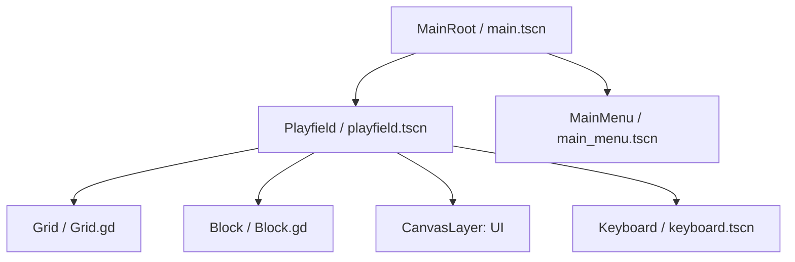
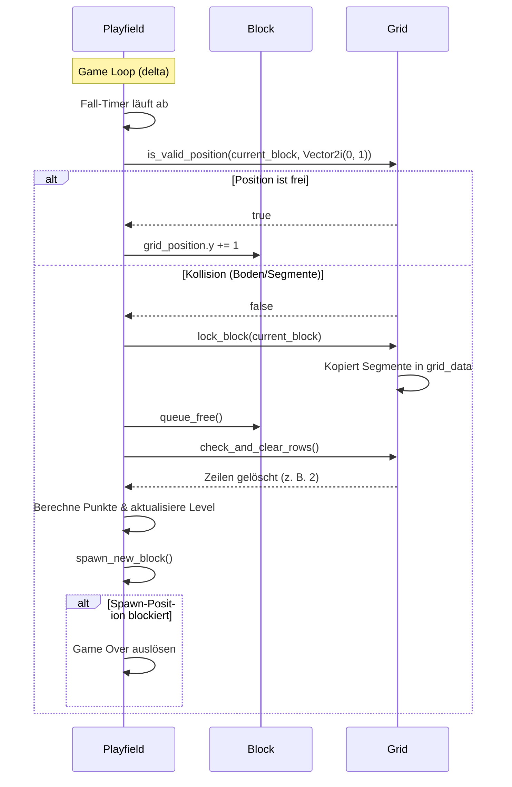

# Spielarchitektur und Design (ARCHITECTURE.md)

Dieses Dokument beschreibt die Softwarearchitektur, Szenenstrukturen und Datenflüsse für **Intercable Connectris**.

> [!NOTE]
> Dieses Dokument wird von **Claude Code** (Senior Engineer & Architect) befüllt und gepflegt.

---

## 1. Szenen-Graph & Komponentenstruktur

Das Spiel wird in Godot 4 modular und signalgesteuert aufgebaut. Die Szenen-Hierarchie trennt die übergeordnete Spielsteuerung von der eigentlichen Spielfeldlogik und der Benutzeroberfläche.



### Komponenten-Zuständigkeiten:
1. **MainRoot (`main.tscn`)**: 
   * Globaler Einstiegspunkt und Szenen-Manager.
   * Lädt/Wechselt zwischen Hauptmenü und Spielfeld.
   * Verwaltet Kiosk-Modus-Einstellungen (Vollbild, Cursor-Sichtbarkeit).
2. **Playfield (`playfield.tscn`)**:
   * Spiel-Schleife (Game Loop), Fall-Geschwindigkeit (Gravity Timer) und Punkteberechnung.
   * Verarbeitet Benutzereingaben (Links, Rechts, Soft/Hard Drop, Rotation).
   * Spawnt neue Blöcke und steuert den Lebenszyklus des aktiven Blocks.
3. **Grid (`Grid.gd` / Node2D)**:
   * Verwaltet das 2D-Gitter (10 Spalten x 20 Zeilen).
   * Führt Kollisionsprüfungen (`is_valid_position`) für den fallenden Block durch.
   * Speichert feste Blöcke (`lock_block`) und löscht volle Zeilen.
   * Bietet API für Power-ups (Spalten/Reihen löschen, Gitter schütteln).
4. **Block (`Block.gd` / Node2D)**:
   * Repräsentiert das fallende Tetromino (7 Standardformen: I, J, L, O, S, T, Z).
   * Verwaltet seine eigene Gitterposition, Farbe und Rotationsmatrizen.
   * **Neu in Connectris**: Jede Zelle des Blocks besitzt ein eigenes Segment mit einem individuellen Zustand (`SegmentType`).
   * Zeichnet sich selbst basierend auf den Segment-Zuständen und Texturen.

---

## 2. Klassendesign (GDScript-Klassenschnittstellen)

### 2.1 SegmentType & Datenstrukturen
Jede aktive Zelle im Spielfeld oder in einem fallenden Block wird durch ein Segment repräsentiert.

```gdscript
class_name Segment
extends RefCounted

enum Type {
	ISOLATED,    # Isoliertes Kabel (Rot, Ausgangszustand)
	BARE,        # Abisoliertes Kabel (Grau, nach Laser/Abisolierer)
	CRIMP_LUG    # Gecrimpter Kabelschuh (Grün, nach Crimper)
}

var type: Type = Type.ISOLATED
var color: Color = Color.WHITE

func _init(p_type: Type = Type.ISOLATED, p_color: Color = Color.WHITE) -> void:
	type = p_type
	color = p_color
```

### 2.2 Block.gd (Klasse: `Block`)
```gdscript
class_name Block
extends Node2D

# 2D-Matrix des Tetrominos (Größe hängt von Form ab, z. B. 3x3 oder 4x4)
# Enthält true/false zur Bestimmung der Belegung
var shape_matrix: Array = []

# Identische Dimensionen wie shape_matrix.
# Enthält Segment-Instanzen für aktive Zellen, null für inaktive.
var cells_data: Array = []

var grid_position: Vector2i = Vector2i.ZERO
var block_color: Color = Color.WHITE

# Initialisiert Form, Farbe und weist jeder Zelle beim Spawn einen zufälligen SegmentType zu
func initialize(p_shape_type: int) -> void:
	pass

# Rotations-Funktionen (mit Matrix-Transponierung)
func rotate_right() -> void:
	pass

func rotate_left() -> void:
	pass

# Hilfsfunktion zur Rückgabe aller aktuell belegten Grid-Positionen mit ihren Segment-Daten
func get_active_segments() -> Array[Dictionary]:
	# Gibt Array von Dicts zurück: {"grid_pos": Vector2i, "segment": Segment}
	return []
```

### 2.3 Grid.gd (Klasse: `Grid`)
```gdscript
class_name Grid
extends Node2D

const COLUMNS: int = 10
const ROWS: int = 20
const CELL_SIZE: int = 48 # Pixel-Größe pro Gitter-Zelle

# 2D-Array der Größe COLUMNS x ROWS. Enthält Segment-Instanzen oder null.
var grid_data: Array = []

# Textur-Caching
var _textures: Dictionary = {}

func _ready() -> void:
	_init_grid()
	_load_textures()

func _init_grid() -> void:
	# Baut das leere 2D-Array auf
	pass

# Prüft auf Kollisionen mit Gittergrenzen oder festen Segmenten
func is_valid_position(block: Block, offset: Vector2i) -> bool:
	return true

# Sperrt die Segmente des fallenden Blocks im Gitter fest
func lock_block(block: Block) -> void:
	pass

# Prüft volle Zeilen, löscht sie und schiebt darüberliegende Segmente nach unten
# Gibt die Anzahl der gelöschten Zeilen für das Scoring zurück
func check_and_clear_rows() -> int:
	return 0

# Power-up-Aktionen
func clear_row(row_index: int) -> void:
	pass

func clear_column(col_index: int) -> void:
	pass

func shake_grid() -> void:
	# Zieht alle Segmente spaltenweise nach unten (Schwerkraft-Kompaktierung)
	pass
```

### 2.4 Playfield.gd (Klasse: `Playfield`)
```gdscript
class_name Playfield
extends Node2D

signal score_changed(new_score: int, level: int)
signal game_over_triggered(final_score: int)

@export var fall_interval_start: float = 1.0

var grid: Grid
var current_block: Block

var _fall_timer: float = 0.0
var _fall_interval: float = 1.0
var _score: int = 0
var _level: int = 1
var _game_over: bool = false

func _ready() -> void:
	# Verknüpft Grid und startet Spielschleife
	pass

func _process(delta: float) -> void:
	pass

func handle_input() -> void:
	pass

func spawn_new_block() -> void:
	pass

func move_block_down() -> void:
	pass

func move_block_horizontal(dir: int) -> void:
	pass

func rotate_block() -> void:
	pass

func hard_drop() -> void:
	pass

func update_difficulty() -> void:
	# Passt _fall_interval basierend auf _level an
	pass
```

---

## 3. Datenfluss & State Machine

Die Interaktionen zwischen den Kern-Objekten erfolgen entkoppelt über Signale.



---

## 4. SQLite Datenbank-Schema

Für die Highscore-Tabelle wird SQLite verwendet. Dies wird in GDScript über einen nativen C++-Wrapper oder ein GDExtension-Plugin angebunden.

### Tabelle: `highscores`
```sql
CREATE TABLE IF NOT EXISTS highscores (
    id INTEGER PRIMARY KEY AUTOINCREMENT,
    initials TEXT NOT NULL CHECK(length(initials) <= 3),
    score INTEGER NOT NULL,
    level INTEGER NOT NULL,
    date TEXT NOT NULL
);
```

* **Index**: Ein Index auf `score DESC, date ASC` optimiert die Abfrage der Top-10 Bestenliste.
* **Date**: Das Datum wird im standardisierten ISO-8601 UTC-Format (`YYYY-MM-DDTHH:MM:SSZ`) als Text gespeichert.
