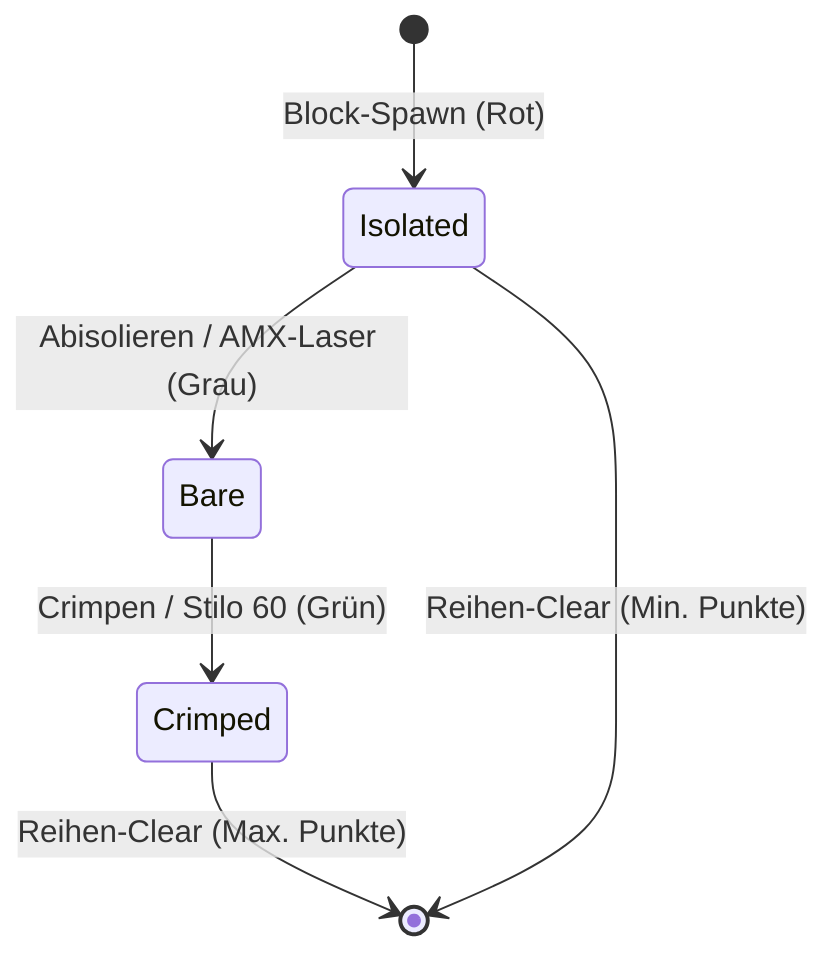

# Legacy-Audit: Intercable Connectris (Initial C# Attempt)

Dieses Dokument enthält das Legacy-Audit des ursprünglichen C#-Prototyps aus dem Branch `archive/initial-attempt`. Es bewertet die vorhandene Codebasis, empfiehlt wiederverwendbare Assets sowie Mechaniken und bereitet den Rebuild in Godot 4 mit GDScript vor.

---

## 1. Dateibewertung (File-by-File Evaluation)

Die folgende Tabelle listet jede Datei aus dem Branch `archive/initial-attempt` auf und bewertet, ob sie übernommen, refaktoriert, verworfen oder als reine Referenz genutzt werden soll.

| Dateipfad | Status | Begründung (max. 2 Sätze) |
| :--- | :--- | :--- |
| `.gitignore` | **Refactoren** | Die Godot-spezifischen Ignore-Einträge bleiben bestehen, während C#-spezifische Build-Ordner (`bin/`, `obj/`, `.vs/`) bereinigt werden. |
| `Autostart.ps1` | **Refactoren** | Nützlich für den Kiosk-Modus, muss jedoch auf den Pfad der neuen GDScript-Engine/Binary angepasst werden. |
| `Intercable Connectris.csproj` | **Verwerfen** | Die MSBuild-C#-Projektdatei ist für den reinen GDScript-Rebuild überflüssig. |
| `Intercable Connectris.sln` | **Verwerfen** | Die Visual Studio Solution-Datei wird im neuen GDScript-Projekt nicht mehr benötigt. |
| `export_presets.cfg` | **Refactoren** | Die Export-Voreinstellungen für Windows Desktop sind nützlich, C#-spezifische Optionen (z. B. `.NET-Embeds`) müssen jedoch entfernt werden. |
| `generate_audio.py` | **Refactoren** | Sollte beibehalten werden, um die Audio-Placeholders dynamisch statt über einen festen absoluten Windows-Pfad zu generieren. |
| `generate_graphics.py` | **Refactoren** | Muss von absoluten Pfaden befreit werden, um universell lauffähig zu bleiben und Grafiken lokal zu generieren. |
| `project.godot` | **Refactoren** | Entfernung des C#-Features und der `.NET`-Sektion sowie Konfiguration von GDScript-Einstiegspunkten und Keybinds. |
| `run_tests.ps1` | **Refactoren** | Muss angepasst werden, um GDScript-Tests (z. B. via GUT-CLI) anstelle des C#-Mono-Testrunners auszuführen. |
| `start.bat` | **Refactoren** | Der Batch-Starter für Windows bleibt für den Kiosk-Modus erhalten, verweist aber auf das neue Build-Target. |
| `scenes/Keyboard.tscn` | **Refactoren** | Das Control-UI-Layout der Bildschirmtastatur wird übernommen, aber mit einem GDScript-Skript verknüpft. |
| `scenes/MainMenu.tscn` | **Refactoren** | Die Struktur des Hauptmenüs bleibt erhalten, das Skript wird jedoch auf GDScript umgeschrieben. |
| `scenes/PlayfieldScene.tscn` | **Refactoren** | Die 2D-Kamerastruktur und das Spielfeld-Root-Verzeichnis werden übernommen und auf das neue GDScript-Spielfeld verwiesen. |
| `src/Database/HighscoreDB.cs` | **Nur als Referenz** | Dient als logische Vorlage für die SQLite-Datenbank-Interaktion, die in GDScript implementiert wird. |
| `src/Game/Playfield.cs` | **Nur als Referenz** | Die Kernlogik des Spielfelds (Falltimer, Input-Handling, Hard Drop) dient als direkte GDScript-Entwurfsvorlage. |
| `src/Game/PowerUpManager.cs` | **Nur als Referenz** | Dient als Vorlage für die vier Power-up-Typen, wird jedoch komplett als GDScript-Klasse neu geschrieben. |
| `src/Game/TetrisBlock.cs` | **Nur als Referenz** | Beschreibt Blockmatrizen und Rotationen; wird als GDScript-Klasse unter Nutzung nativer Vektoren übersetzt. |
| `src/Game/TetrisGrid.cs` | **Nur als Referenz** | Vorlage für Kollisionsprüfungen, Zeilenlöschung und Spezialeffekte wie Gitter-Schütteln. |
| `src/Main.cs` | **Verwerfen** | Ein einfacher Hello-World-Platzhalter ohne relevante Spiellogik. |
| `src/Tests/Assert.cs` | **Verwerfen** | Obsolet, da GDScript-Unit-Test-Frameworks (z. B. GUT) bereits umfangreiche Assert-Funktionen bieten. |
| `src/Tests/DatabaseTests.cs` | **Nur als Referenz** | Dient als Vorlage für das Schreiben von Modultests der SQLite-Datenbank unter GDScript. |
| `src/Tests/GridTests.cs` | **Nur als Referenz** | Enthält Test-Schablonen, die als Spezifikation für die Testabdeckung im neuen Gitter dienen. |
| `src/Tests/TestRunner.cs` | **Verwerfen** | Der reflexionsbasierte Test-Runner ist C#-spezifisch und wird durch ein natives GDScript-Testtool ersetzt. |
| `src/Tests/TestRunner.tscn` | **Verwerfen** | Die Szene für den C#-Test-Runner wird im neuen GDScript-Projekt nicht mehr benötigt. |
| `src/UI/Keyboard.cs` | **Nur als Referenz** | Logik-Vorlage für das Signal- und Eingabehandling der Bildschirmtastatur. |
| `src/UI/MainMenu.cs` | **Nur als Referenz** | Logik-Vorlage für die Initialisierung des Hauptmenüs und das Auslesen der Highscore-Liste. |
| `assets/audio/*` | **Übernehmen** | Alle generierten `.wav`-Dateien (Laser, Pressen, Schneiden, Klick) können unverändert verwendet werden. |
| `assets/textures/*` | **Übernehmen** | Die 64x64-PNG-Grafiken für Kabelzustände und Power-ups sind als funktionale UI-Platzhalter sofort einsatzbereit. |

---

## 2. Empfehlungen für Assets und Skripte

### Grafik- & Audio-Assets
* **Synthetisiertes Audio (`assets/audio/`)**: 
  Die vier erzeugten Soundeffekte passen klanglich gut zum minimalistischen Arcade-Stil:
  * `pressen.wav`: Satter, tiefer Sound für das Festsetzen (Lock) eines Blocks.
  * `schneiden.wav`: Rauschen für das Abschneiden einer Reihe.
  * `laser_zischen.wav`: Frequenz-Sweep für den Spalten-Laser.
  * `menu_klick.wav`: Kurzer Klick-Ton für UI-Interaktionen.
* **Textur-Placeholders (`assets/textures/`)**:
  Die Texturen haben eine Kantenlänge von 64x64 Pixeln (obwohl das C#-Spielfeld sie auf 48x48 Pixel gestaucht gezeichnet hat). Sie sind farblich klar unterscheidbar und beschriftet, was das Debuggen der Kabelzustände erleichtert.

### Skripte zur Asset-Generierung
* Die Python-Skripte `generate_audio.py` und `generate_graphics.py` sind hervorragende Werkzeuge für die CI/CD-Pipeline oder zur schnellen Anpassung von Platzhaltern. Sie müssen lediglich refaktoriert werden, um den Workspace-Pfad relativ über `os.path.dirname(__file__)` aufzulösen, anstatt einen festen Windows-Pfad zu verwenden.

---

## 3. Empfehlungen für Spielmechaniken & Rebuild

> [!IMPORTANT]
> **Das Kabelverarbeitungs-Konzept (Core Loop)**
> Im ursprünglichen C#-Code waren Datenstrukturen für Kabelzustände (`CableState: Isolated, Bare, Crimped`) definiert. Das eigentliche Gameplay hat diese Zustände jedoch noch nicht aktiv genutzt (alle Blöcke wurden als `Isolated` gespawnt und verblieben so). 
> Für den GDScript-Rebuild empfehlen wir, diese Mechanik voll spielbar zu machen, um den Bezug zu den Werkzeugen von Intercable herzustellen.

### Empfohlener Kabel-Verarbeitungs-Loop:
1. **Isolated (Isoliert, Rot)**: Blöcke spawnen standardmäßig isoliert.
2. **Stripping (Abisolieren)**: Ein Power-up (z. B. **AMX Laser** oder ein spezielles Werkzeug-Match) befreit die Adern der Blöcke und überführt sie in den Zustand **Bare (Blank, Grau)**.
3. **Crimping (Crimpen)**: Das Crimp-Power-up (z. B. **Stilo 60**) crimpt Kabelenden und überführt sie in **Crimped (Gecrimpt, Grün)**.
4. **Scoring**: Reihen, die vollständig aus *gecrimpten* (fertig angeschlossenen) Leitungen bestehen, geben einen signifikant höheren Score-Multiplikator als unfertige Reihen.

### Power-Up Mechaniken (Werkzeuge von Intercable):
* **AMX Laser**: Löscht im Prototyp eine komplette Spalte. *Vorschlag für Rebuild*: Kann zusätzlich alle Blöcke einer Spalte abisolieren (`Bare`).
* **Slick Cutter**: Löscht eine komplette Reihe. *Vorschlag für Rebuild*: Ideal als Panik-Knopf für blockierte Reihen.
* **STILO60 Beben**: Löst ein Gitterbeben aus, wodurch alle Blöcke durch Gravitation in die tiefstmöglichen freien Zellen fallen. *Vorschlag für Rebuild*: Gleichzeitiges Crimpen aller bereits abisolierten Blöcke auf dem Spielfeld.
* **VDE Schutzschild**: Schützt vor dem nächsten Fehler (z. B. falsches Platzieren eines Blocks oder Blockieren des oberen Spielfeldrands).

### Technische Parameter:
* **Gitter-Dimensionen**: 10 Spalten x 20 Zeilen.
* **Skalierung & Auflösung**: Das Spiel läuft nativ auf 1920x1080 (Full HD, Vollbild, rahmenlos) für den Kiosk-Betrieb. Die Blockgröße sollte im Rebuild einheitlich auf **48px** oder **64px** gesetzt werden, um Interpolationsunschärfen der Texturen zu vermeiden.
* **Datenbank**: SQLite-Highscore-Tabelle (`Highscores`) mit den Spalten `Id`, `Initials`, `Score`, `Level`, `Date`. Diese Struktur sollte eins-zu-eins in der neuen GDScript-Datenbankanbindung implementiert werden, um Kompatibilität zu wahren.
