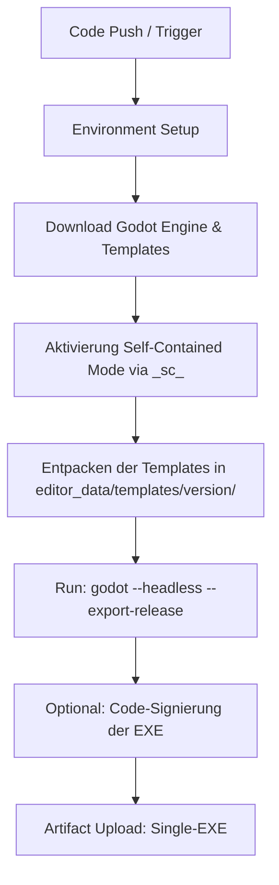

# Best Practices für portable Single-EXEs und Headless-Build-Tooling in Godot 4

Dieses Dokument beschreibt die Best Practices zur Erstellung von portablen Single-Executable-Dateien (Single-EXEs) und die Automatisierung des Build-Prozesses mittels Headless-Tooling unter Windows 11 für das Projekt **Intercable Connectris**.

---

## 1. Portable Single-EXE in Godot 4

Für Kiosk-Systeme ist eine einzelne, in sich geschlossene Datei (`.exe`) oft die sauberste Lösung, da sie die Verteilung vereinfacht und das Risiko minimiert, dass Begleitdateien (wie `.pck`-Archive) beschädigt, verschoben oder gelöscht werden.

### Einbetten der PCK-Datei (Pack-Datei)
Standardmäßig generiert Godot beim Export eine ausführbare Datei (`game.exe`) und eine separate Pack-Datei (`game.pck`), welche alle Assets, Szenen und Skripte enthält. Godot 4 ermöglicht es jedoch, diese Pack-Datei direkt in die Binärdatei einzubetten.

#### Einrichtung im Godot Editor:
1. Öffnen Sie das Projekt im Godot Editor.
2. Navigieren Sie zu **Projekt > Exportieren...**.
3. Wählen Sie das Export-Preset für **Windows Desktop** (oder erstellen Sie eines).
4. Suchen Sie in den Einstellungen des Presets im Reiter **Optionen** den Bereich **Binary Format**.
5. Setzen Sie die Option **Embed Pck** (PCK einbetten) auf **An (On)**.
6. Schließen Sie das Menü. Die Konfiguration wird in der Datei `export_presets.cfg` im Projektverzeichnis gespeichert.

> [!IMPORTANT]
> **Code-Signierung und Antivirus-Fehlalarme:**
> * **Signierung:** Das nachträgliche Signieren einer EXE-Datei, in die ein PCK eingebettet ist, kann unter Windows zu Validierungsfehlern führen. Wenn das Spiel digital signiert werden muss, sollte dies vorzugsweise mit externen Tools getestet oder die PCK separat ausgeliefert werden.
> * **Antiviren-Erkennung:** Gelegentlich stufen Windows Defender oder andere Virenscanner selbst erstellte Single-EXEs, die eingebettete PCKs enthalten, fälschlicherweise als Bedrohung (False Positive) ein, da sich die Dateistruktur von typischen PE-Binärdateien unterscheidet. Ein digitaler Signaturprozess löst dieses Problem in der Regel.

### Datenpersistenz und Schreibrechte (Portable vs. System-Pfad)
Ein echtes portables Spiel speichert seine Daten (Spielstände, Einstellungen, Logs) im eigenen Verzeichnis. Bei Windows-Kiosk-Systemen is hierbei jedoch Vorsicht geboten:
1. **Schreibgeschützte Verzeichnisse:** Wenn die Single-EXE unter `C:\Program Files\` oder einem anderen geschützten Systemordner liegt, schlagen Schreibversuche im Anwendungsverzeichnis fehl, sofern die Anwendung nicht mit Administratorrechten ausgeführt wird.
2. **Best Practice für Kiosks:**
   * Verwenden Sie standardmäßig den Pfad `user://` für alle persistenten Schreibvorgänge. Godot löst diesen unter Windows automatisch nach `%APPDATA%\Godot\app_userdata\<Projektname>\` auf. Dieser Pfad ist für den Kiosk-Benutzer (Standardbenutzer) immer beschreibbar.
   * Wenn Daten zwingend lokal im selben Verzeichnis wie die EXE gespeichert werden müssen, stellen Sie sicher, dass das Installationsverzeichnis (z. B. `C:\KioskApp\`) explizite Schreibrechte für den Kiosk-Benutzer besitzt, und nutzen Sie `OS.get_executable_path().get_base_dir()` in GDScript zur Pfadbestimmung.

---

## 2. Selbsthaltender Modus (Self-Contained Mode) des Editors

Für Build-Server, CI/CD-Pipelines oder portable Entwickler-Setups ist es oft unerwünscht, dass der Godot-Editor Konfigurationen und Export-Templates global im Benutzerverzeichnis (`%APPDATA%`) ablegt.

### Aktivierung des Self-Contained-Modus:
Erstellen Sie im selben Ordner, in dem sich die Godot-Editor-Ausführungsdatei (`Godot_v4.x-stable_win64.exe`) befindet, eine leere Datei namens:
* `_sc_` (oder `._sc_` für Unix-Systeme).

### Auswirkung:
Sobald diese Datei existiert, legt Godot alle Einstellungen, den Cache und die installierten Export-Templates in einem lokalen Unterordner namens `editor_data/` an. Dies isoliert die Build-Umgebung vollständig vom restlichen Betriebssystem.

---

## 3. Headless-Build-Tooling

In Godot 4 gibt es keine separate Server-Binärdatei (wie `godot-server` in Godot 3) mehr. Stattdessen wird die Standard-Editor-Binärdatei mit einem Kommandozeilen-Parameter aufgerufen.

### Der `--headless` Parameter
Um Exporte ohne grafische Oberfläche (GUI) und ohne Rendering-Kontext auszuführen, wird der Parameter `--headless` angehängt. Dies ist ideal für CI/CD-Pipelines und PowerShell-Skripte auf Servern.

### Syntax für den CLI-Export:
```powershell
path/to/godot.exe --headless --path "path/to/project_directory" --export-release "Windows Desktop" "path/to/output/game.exe"
```
* `--headless`: Verhindert das Öffnen eines Fensters und die Initialisierung des Audio/Grafiktreibers.
* `--path`: Zeigt auf den Ordner, der die `project.godot` enthält.
* `--export-release`: Führt den Release-Export unter Verwendung des exakten Namens des in `export_presets.cfg` konfigurierten Presets aus.

### Automatisierte Installation der Export-Templates via CLI
Da Godot keinen nativen CLI-Befehl zum Herunterladen/Installieren von Export-Templates besitzt, muss dieser Prozess in CI/CD-Pipelines skriptbasiert gelöst werden.

#### Ablauf der Automatisierung (PowerShell-Beispiel):
```powershell
# Variablen definieren
$GodotVersion = "4.2.1.stable"
$TemplateUrl = "https://github.com/godotengine/godot/releases/download/$GodotVersion/Godot_v$GodotVersion`_export_templates.tpz"
$TempZip = "$env:TEMP\templates.zip"
$TargetDir = "$env:APPDATA\Godot\export_templates\$GodotVersion"

# 1. Zielverzeichnis erstellen, falls nicht vorhanden
if (!(Test-Path $TargetDir)) {
    New-Item -ItemType Directory -Force -Path $TargetDir | Out-Null
}

# 2. Template-Paket herunterladen (.tpz ist ein umbenanntes ZIP-Archiv)
Write-Host "Lade Export-Templates herunter..."
$WebRequest = Invoke-WebRequest -Uri $TemplateUrl -OutFile $TempZip

# 3. Entpacken der Dateien
Write-Host "Entpacke Templates..."
Expand-Archive -Path $TempZip -DestinationPath "$env:TEMP\godot_templates_extracted" -Force

# 4. Templates in das korrekte Godot-Verzeichnis verschieben
# Das TPZ enthält einen Unterordner 'templates/', dessen Inhalt verschoben werden muss
Move-Item -Path "$env:TEMP\godot_templates_extracted\templates\*" -Destination $TargetDir -Force

# 5. Bereinigung
Remove-Item -Path $TempZip -Force
Remove-Item -Path "$env:TEMP\godot_templates_extracted" -Recurse -Force

Write-Host "Export-Templates erfolgreich für Version $GodotVersion installiert."
```

> [!TIP]
> Bei Verwendung des **Self-Contained-Modus** auf dem Build-Server müssen die Templates nicht nach `%APPDATA%\Godot\...` kopiert werden, sondern in den Ordner `editor_data/templates/<version>/` relativ zur Godot-Editor-EXE.

---

## 4. Empfohlene CI/CD Pipeline-Architektur

Für ein professionelles Deployment empfiehlt sich folgende Strukturierung des Build-Prozesses (z.B. in GitHub Actions oder GitLab CI):



Durch diese Pipeline wird sichergestellt, dass jede Version von **Intercable Connectris** vollautomatisch, konsistent und ohne manuelle Interaktion als hochgradig portable Single-EXE generiert wird.
